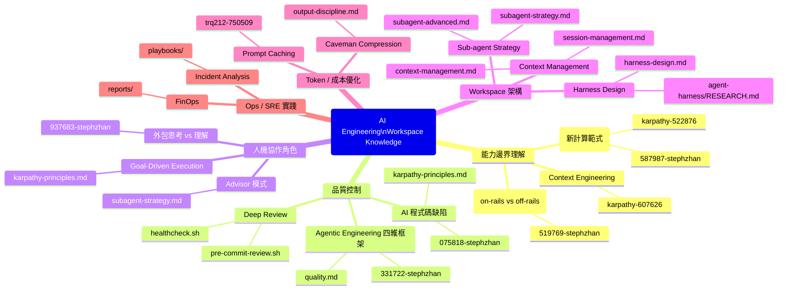

# Research Index — 知識地圖

> 導覽層：快速找到相關研究，了解整合狀態
> 更新日期：2026-05-26
> 檔案總數：160 tweets + 49 ai-articles (scored) + 18 reports + 6 videos + 66 digests
>
> **子目錄 → Skill 對應：**
> `agent-harness/` → `/harness-meta` · `ai-articles/` → `/research-hub`

---

## 心智圖

---

## 主題索引

### AI Engineering Fundamentals

| 文章 | 評分 | 整合狀態 | 核心洞見 |
|------|------|---------|---------|
| [Karpathy Context Engineering](tweets/2025-06-25-@karpathy-607626.md) | 9.2 | ✅ → context-management.md | Context = 工程紀律，不是 prompt 優化 |
| [Jaggedness on-rails/off-rails](tweets/2026-04-29-@stephzhan-519769.md) | 5.6 | 📋 → 待補 subagent-strategy.md | On-rails 信任高委派，off-rails 需人驗證 |
| [Software 3.0](tweets/2026-04-29-@stephzhan-587987.md) | 5.1 | 🗂 Skip（Karpathy 原文更完整）| 問「以前根本不可能的是什麼？」|
| [Karpathy No Priors](tweets/2026-01-26-@karpathy-522876.md) | — | — | Software 1.0/2.0/3.0 完整框架 |

### Agentic Engineering Quality

| 文章 | 評分 | 整合狀態 | 核心洞見 |
|------|------|---------|---------|
| [四維框架（vibe vs agentic）](tweets/2026-04-29-@stephzhan-331722.md) | 6.0 | 📋 → 待加 quality.md | security/reliability/maintainability/taste |
| [AI 程式碼四大缺陷](tweets/2026-04-29-@stephzhan-075818.md) | 6.6 | 📋 → 待加 karpathy-principles.md | bloated/copy-paste/brittle/abstraction |
| [Skill Authoring Patterns](ai-articles/scored/2026-04-20-skill-authoring-patterns.md) | — | ✅ → skill-authoring.md | 14 設計模式，description 預算 |
| [Claude Opus 4.7 System Prompt](ai-articles/scored/2026-04-20-claude-opus47-system-prompt.md) | — | ✅ → anthropic-insights.md | 工具呼叫次數、著作權規則 |

### 人機協作角色分工

| 文章 | 評分 | 整合狀態 | 核心洞見 |
|------|------|---------|---------|
| [外包思考 vs 理解](tweets/2026-04-29-@stephzhan-937683.md) | 5.9 | 🗂 Skip（理念已在 core.md）| 不可外包：what matters / true / build / why |
| [Thariq prompt caching 設計](tweets/2026-02-04-@trq212-750509.md) | — | ✅ → context-management.md | Static first, tools 不能 mid-session 改變 |
| [Boris session forking](tweets/2026-01-31-@bcherny-321619.md) | — | ✅ → session-management.md | /branch / /btw / /focus |

### Workspace / Harness 架構

| 資源 | 類型 | 說明 |
|------|------|------|
| [agent-harness/RESEARCH.md](agent-harness/RESEARCH.md) | 深度研究 | 22 資源合成，PGE 架構 |
| [agent-harness/SURVEY.md](agent-harness/SURVEY.md) | 調查報告 | Harness 元件調查 |
| [agent-harness/KNOWLEDGE-MAP.md](agent-harness/KNOWLEDGE-MAP.md) | 知識地圖 | Agent harness 知識結構 |
| [agent-harness/llm-routing-industrial-cases.md](agent-harness/llm-routing-industrial-cases.md) | 工業案例 | RouteLLM 75% cheaper；Martian 300+ 企業 |

### 🆕 AI Articles（2026-05-09）

| 資源 | 核心主題 |
|------|---------|
| [anthropic-april-23-postmortem](ai-articles/scored/2026-05-09-anthropic-april-23-postmortem-claude-code-quality.md) | Claude Code 品質事後分析 |
| [anthropic-harness-design](ai-articles/scored/2026-05-09-anthropic-harness-design-long-running-apps.md) | 長時間運行 Agent Harness 設計 |
| [terminal-bench-2-0](ai-articles/scored/2026-05-09-terminal-bench-2-0.md) | TerminalBench 2.0 基準測試 |
| [cursor-agent-harness](ai-articles/scored/2026-05-09-cursor-continually-improving-agent-harness.md) | Cursor 持續改善 harness 策略 |
| [langchain-deep-agents](ai-articles/scored/2026-05-09-langchain-deep-agents-harness-engineering.md) | LangChain 深度 agent 工程 |

### Token / 成本優化

| 資源 | 類型 | 說明 |
|------|------|------|
| Caveman 壓縮測試結果 | 實測數據 | EN -80.6%，ZH -86.2%，品質 +1.86 |

---

## 整合狀態說明

| 符號 | 說明 |
|------|------|
| ✅ → file.md | 已整合到指定規則/文件 |
| 📋 → 待加 file.md | 評分達標，等待整合的行動 |
| 🗂 Skip | 總分 < 6 或已被其他資源涵蓋 |
| — | 未評分或需要後續評分 |

---

## 深度分析文件

| 文件 | 日期 | 涵蓋範圍 |
|------|------|---------|
| [LLM 路由工業案例](agent-harness/llm-routing-industrial-cases.md) | 2026-05-08 | RouteLLM + Martian + RouterBench；AgentOpt 限制；任務類型限制 |

---

## 待整合行動（按優先序）

| 行動 | 來源 | 目標位置 | 優先 |
|------|------|---------|------|
| on-rails/off-rails 任務分類矩陣 | stephzhan-519769 | `.claude/rules/subagent-strategy.md` | 🔴 |
| 四維品質 checklist（security/reliability/maintainability/taste）| stephzhan-331722 | `.claude/rules/quality.md` | 🔴 |
| AI 程式碼四大缺陷反模式列表 | stephzhan-075818 | `.claude/rules/karpathy-principles.md` | 🔴 |

---

## Skill Candidates 狀態

全數 promoted 或清除完畢（2026-05-15）。`skill-candidates/` 目錄已移除；ALLOWLIST.yaml / REVIEW_GUIDE.md 保留於 git 歷史。

_最後更新：2026-05-26_

---

## Knowledge Graph — Typed Edges（GBrain 模式）

> 邊類型定義（參考 GBrain `attended`/`works_at`/`invested_in`）：
> - `implements` — 下層落實上層原則
> - `references` — 引用為設計依據
> - `inspired_by` — 受該來源啟發
> - `extends` — 在原有基礎上擴展
> - `contradicts` — 與該來源觀點相反（需標注）
> - `supersedes` — 取代舊版

| From（workspace 構件） | Edge | To（來源 / 概念） | 說明 |
|----------------------|------|-----------------|------|
| `.claude/rules/context-management.md` | `implements` | Karpathy Context Engineering | Static-first、NLAH 原則直接落實 |
| `.claude/rules/subagent-strategy.md` | `implements` | Multi-Agent Coordination Patterns | Fan-out ≤4、centralized 拓撲 |
| `.claude/rules/core.md` | `inspired_by` | bcherny-claude (Latent vs Deterministic) | Rule 5 LLM-只做判斷原則 |
| `.claude/rules/output-discipline.md` | `inspired_by` | bcherny-claude (Demand Elegance) | 精簡輸出、禁填充語 |
| `.claude/skills/autoresearch/` | `implements` | Karpathy LLM Wiki (Ingest/Query/Lint ops) | wiki-workflow.md 對應三操作 |
| `.claude/refs/advisor-tool-api.md` | `implements` | AgentOpt 論文 (arXiv:2604.06296) | Advisor Strategy 學理依據 |
| `.claude/hooks/pre-compact.sh` | `implements` | arXiv:2605.12978 Batch Gate | Batch 維持 100%，Stream 衰退至 46% |
| `memory/MEMORY.md` | `implements` | arXiv:2605.12978 Episodic-First | Batch Gate 5-10 session 觸發 |
| `.claude/refs/brain-first-protocol.md` | `inspired_by` | GBrain (`gbrain think` 模式) | brain-first lookup 四層 hierarchy |
| `.claude/skills/skill-evolution/` | `inspired_by` | Hermes Agent autonomous skill refinement | 技能自主進化追蹤機制 |
| `.claude/skills/harness-meta/` | `extends` | `agent-harness/RESEARCH.md` | 22 資源合成後的操作化 skill |
| `scripts/wiki-lint.sh` | `implements` | Karpathy LLM Wiki (Lint op) | 自動化 wiki 健康檢查 |
| `scripts/wiki-ingest.py` | `implements` | Karpathy LLM Wiki (Ingest op) | digest→wiki 橋接管線 |
