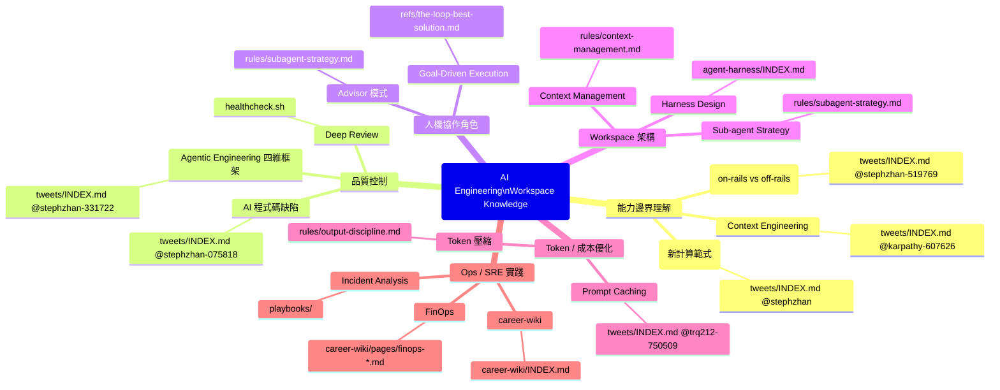

# Research Index — 知識地圖

> 導覽層：O(1) 定位各目錄，詳細內容見各目錄 INDEX.md  
> 更新日期：2026-08-04
> **計數基準（單一來源）**：檔案數僅在下方「目錄總覽」表維護，基準為目錄內檔案總數（含子目錄/附件，`find -type f`）；精確數字以各目錄自己的 INDEX.md 為準。「各目錄快查」不重複列數字（2026-07-06 起，修正過去雙表數字漂移的根因）。
> **Agent 入口**：先讀 `../BRAIN.md`（全域 lookup），再用本表定位 research/ 子目錄  
> **子目錄 → Skill 對應：**  
> `agent-harness/` → `/harness-meta` · `ai-articles/` → `/research-hub` · `career-wiki/` → `/autoresearch:wiki`  
> `ai-news/` → overnight-research · `papers/` → research-hub:deep · `best-practices/` → research-hub:audit

---

## 目錄總覽

| 目錄 | 檔案數 | 說明 | INDEX |
|------|--------|------|-------|
| `ai-news/` | 600+ | 每日 AI 新聞 digest（52 個啟用來源，含 infra-ops 跨域補強）| `→ INDEX.md` |
| `ai-articles/` | 220 | scored（50）/ inbox 已清空 / low-score（無）| `→ INDEX.md` |
| `tweets/` | 393 | Twitter 重要技術 thread 歸檔 | [→ INDEX.md](tweets/INDEX.md) |
| `papers/` | 331 | arXiv / 學術論文（PDF + Markdown）| [→ INDEX.md](papers/INDEX.md) |
| `agent-harness/` | 75 | Harness 深度研究 + eval + benchmark | `→ INDEX.md` |
| `career-wiki/` | 52 | 9 段職涯 × 36 pages + raw/schema（供 zeuik-senior-architect）| `→ INDEX.md` |
| `reports/` | 177 | 合成報告 / Gap analysis / Deep research 輸出（active，archived 另計）| [→ INDEX.md](reports/INDEX.md) |
| `best-practices/` | 46 | Claude Code 最佳實踐研究 | [→ INDEX.md](best-practices/INDEX.md) |
| `claude-blog/` | 14 | Anthropic 官方 blog / docs 歸檔 | [→ INDEX.md](claude-blog/INDEX.md) |
| `evals/` | 63 | Harness eval runs + baseline + SIA Routine 量化閘（sia-routine-{a,c,f} + sia-report-audit）| `→ INDEX.md` |
| `videos/` | 8 | Podcast / 影片摘要 | [→ INDEX.md](videos/INDEX.md) |
| `workspace-agent-architecture/` | 6 | Workspace 智能體化全案（SPEC + MCP 轉換 + KYU OS 層 + SIA 接線 + client 路線）| `→ INDEX.md` |
| `unknowns-workspace-refine/` | 3 | Know Your Unknowns 導入 + workspace refine 全案（PLAN / 盲點報告）| `→ INDEX.md` |
| `the-loop-harness-v5/` | 9 | **現行 harness 世代**：v5.1 單人 baseline、六題 fixture、三模型結果與限制。**條文 canonical = `.claude/rules/`，不在此** | `→ INDEX.md` |
| `archive/` | 53 | **唯讀封存**：the-loop-harness-v2/v3/v4 三代（2026-07-26 封存）。**只供參考、不得採用**——內容係對舊契約撰寫 | `→ INDEX.md` |

---

## 心智圖

```mermaid
mindmap
  root(AI Engineering\nWorkspace Knowledge)
    能力邊界理解
      Jaggedness(on-rails vs off-rails)
        tweets/INDEX.md @stephzhan-519769
      Context Engineering
        tweets/INDEX.md @karpathy-607626
      Software 3.0(新計算範式)
        tweets/INDEX.md @stephzhan
    品質控制
      Agentic Engineering 四維框架
        tweets/INDEX.md @stephzhan-331722
      AI 程式碼缺陷
        tweets/INDEX.md @stephzhan-075818
      Deep Review
        healthcheck.sh
    人機協作角色
      Goal-Driven Execution
        refs/the-loop-best-solution.md
      Advisor 模式
        rules/subagent-strategy.md
    Workspace 架構
      Harness Design
        agent-harness/INDEX.md
      Sub-agent Strategy
        rules/subagent-strategy.md
      Context Management
        rules/context-management.md
    Token / 成本優化
      Prompt Caching
        tweets/INDEX.md @trq212-750509
      Token 壓縮
        rules/output-discipline.md
    Ops / SRE 實踐
      career-wiki
        career-wiki/INDEX.md
      FinOps
        career-wiki/pages/finops-*.md
      Incident Analysis
        playbooks/
```

---

## 主題索引（精選 × 整合狀態）

> 完整清單見各目錄 INDEX.md。本表只列「已整合」或「待整合高優先」項目。

### AI Engineering Fundamentals

| 文章 | 評分 | 整合狀態 | 核心洞見 |
|------|------|---------|---------|
| [Karpathy Context Engineering](tweets/2025-06-25-@karpathy-607626.md) | 9.2/10 | ✅ → context-management.md | Context = 工程紀律，不是 prompt 優化 |
| [Jaggedness on-rails/off-rails](tweets/2026-04-29-@stephzhan-519769.md) | 5.6/10 | 📋 → 待補 subagent-strategy.md | On-rails 信任高委派，off-rails 需人驗證 |
| [Software 3.0](tweets/2026-04-29-@stephzhan-587987.md) | 5.1/10 | 🗂 Skip（Karpathy 原文更完整）| 問「以前根本不可能的是什麼？」|
| [Karpathy No Priors](tweets/2026-01-26-@karpathy-522876.md) | — | — | Software 1.0/2.0/3.0 完整框架 |

→ 更多 tweets：[tweets/INDEX.md](tweets/INDEX.md)

### Agentic Engineering Quality

| 文章 | 評分 | 整合狀態 | 核心洞見 |
|------|------|---------|---------|
| [四維框架（vibe vs agentic）](tweets/2026-04-29-@stephzhan-331722.md) | 6.0/10 | 📋 → 待加 quality.md | security/reliability/maintainability/taste |
| [AI 程式碼四大缺陷](tweets/2026-04-29-@stephzhan-075818.md) | 6.6/10 | 📋 → 待加 karpathy-principles.md | bloated/copy-paste/brittle/abstraction |
| `Skill Authoring Patterns` | — | ✅ → skill-authoring.md | 14 設計模式，description 預算 |
| `Claude Opus 4.7 System Prompt` | — | ✅ → anthropic-insights.md | 工具呼叫次數、著作權規則 |

→ 更多 ai-articles：`ai-articles/INDEX.md`

### 人機協作角色分工

| 文章 | 評分 | 整合狀態 | 核心洞見 |
|------|------|---------|---------|
| [外包思考 vs 理解](tweets/2026-04-29-@stephzhan-937683.md) | 5.9/10 | 🗂 Skip（理念已在 core.md）| 不可外包：what matters / true / build / why |
| [Thariq prompt caching 設計](tweets/2026-02-04-@trq212-750509.md) | — | ✅ → context-management.md | Static first, tools 不能 mid-session 改變 |
| [Boris session forking](tweets/2026-01-31-@bcherny-321619.md) | — | ✅ → session-management.md | /branch / /btw / /focus |
| [Boris internal dialogue — auto mode / routines / loop 哲學](tweets/2026-06-09-@Saccc_c-2064243393.md) | — | 📋 → 待整合 | plan mode 已死、routines 殺手應用、context engineering 已死 |

---

## 各目錄快查（Agent 跳轉）

> 本節只列分類維度，**不重複列數量**——精確檔案數以上方「目錄總覽」表或各目錄自己的 INDEX.md 為準。過去這裡的數字因與目錄總覽各自獨立維護，多處已與目錄總覽不一致（papers/reports/tweets/substack/prompts），移除數字後只剩一個計數來源，同步錯誤無從發生。

### ai-articles → `INDEX.md`
Karpathy×Mnilax 評分框架；含整合狀態（✅/📋/🔵/🗂）

### the-loop-harness-v5 → `INDEX.md`

現行 harness 世代。**行為契約條文不在此**——canonical = `.claude/rules/`（v5 裁決條文單一 owner，不再有 `HARNESS-CORE-vN.md` 全文層）。本目錄只放 rules/ 放不下的：證據表、`[E]` Body 覆蓋矩陣、backlog。

### archive → `INDEX.md`

the-loop-harness-v2/v3/v4 三代，2026-07-26 封存、唯讀。**只供參考，不得採用**：內容係對各自世代的契約撰寫。v5.1 的新 fixture 與 baseline 只以 `tests/harness-v51-baseline/` 及 `research/the-loop-harness-v5/` 為準。

### agent-harness → `INDEX.md`
Living docs：HARNESS-CARD · KNOWLEDGE-MAP · RESEARCH · RATCHET + eval 紀錄（另有 references 歸檔）

### papers → [INDEX.md](papers/INDEX.md)
按 11 domains 分類：Memory / Harness / Agent-Arch / Multi-Agent / Routing / RAG / Perf / Safety / Benchmarks / Context / Other

### reports → [INDEX.md](reports/INDEX.md)
分 6 topics：Harness / Memory / Auto-load / Workspace-Gap / Skill / Best-Practices（含 archive/ 歷史封存）

### career-wiki → `INDEX.md`
按 10 domains 分頁；Lint 100/100；consumer: `zeuik-senior-architect`

### tweets → [INDEX.md](tweets/INDEX.md)
按 Author（50+）× 10 topic categories 分類（curated items 分類見 INDEX）

### best-practices → [INDEX.md](best-practices/INDEX.md)
Official + community Claude Code best practices

### claude-blog → [INDEX.md](claude-blog/INDEX.md)
按 5 categories 分類（claude-code / agents / announcements / enterprise-ai / docs；歸檔文章條目見 INDEX）

### ai-news → `INDEX.md`
16 newsletters；digest types：combined / deepsrt / devops

按 6 themes 分類；2024-02 → 持續更新

### videos → [INDEX.md](videos/INDEX.md)
Karpathy × Sequoia × Boris × nateherk × AI Engineer × Lenny's

### evals → `INDEX.md`
Baseline task specs + eval runs（2026-05-25 起）

---

## 待整合行動（按優先序）

| 行動 | 來源 | 目標位置 | 優先 |
|------|------|---------|------|
| on-rails/off-rails 任務分類矩陣 | [stephzhan-519769](tweets/2026-04-29-@stephzhan-519769.md) | `.claude/rules/subagent-strategy.md` | 🔴 |
| 四維品質 checklist | [stephzhan-331722](tweets/2026-04-29-@stephzhan-331722.md) | `.claude/rules/quality.md` | 🔴 |
| AI 程式碼四大缺陷反模式 | [stephzhan-075818](tweets/2026-04-29-@stephzhan-075818.md) | `.claude/rules/karpathy-principles.md` | 🔴 |
| harness-engineering-ai-warmwater 整合 | `ai-articles scored 7.25/10` | `.claude/skills/harness-meta/` | 🟡 |

---

## Knowledge Graph — Typed Edges（GBrain 模式）

| From | Edge | To | 說明 |
|------|------|----|------|
| `.claude/rules/context-management.md` | `implements` | [tweets/@karpathy-607626](tweets/2025-06-25-@karpathy-607626.md) | Static-first、NLAH 原則 |
| `.claude/rules/subagent-strategy.md` | `implements` | `agent-harness/KNOWLEDGE-MAP.md` | Fan-out ≤4、centralized 拓撲 |
| `.claude/rules/core.md` | `inspired_by` | [tweets/@bcherny](tweets/2026-01-31-@bcherny-321619.md) | Rule 5 LLM-只做判斷原則 |
| `.claude/skills/autoresearch/` | `implements` | `career-wiki/raw/karpathy-llm-wiki-gist.md` | Ingest/Query/Lint 三操作 |
| `research/career-wiki/` | `implements` | Karpathy LLM Wiki (3-layer) | Raw → Wiki → Schema 完整三層 |
| `.claude/agents/zeuik-senior-architect.md` | `references` | `career-wiki/INDEX.md` | 架構決策時直讀 career-wiki |
| `.claude/refs/advisor-tool-api.md` | `implements` | [papers/agentopt-2604-06296](papers/2026-04-07-agentopt-client-side-optimization.md) | Advisor Strategy 學理依據 |
| `.claude/hooks/pre-compact.sh` | `implements` | [papers/useful-memories-2605-12978](papers/2026-05-13-useful-memories-faulty-llm-continuous-update-2605-12978.md) | Batch Gate 100% vs Stream 46% |
| `.claude/skills/skill-evolution/` | `inspired_by` | `agent-harness/KNOWLEDGE-MAP.md` | Hermes 自主進化 |
| `.claude/skills/harness-meta/` | `extends` | `agent-harness/RESEARCH.md` | 22 資源合成 → 操作化 skill |
| `ai-articles/scored/2026-04-02-harness-engineering-ai-warmwater.md` | `references` | `.claude/skills/harness-meta/` | Harness 五維度（7.25/10，待整合）|
| `career-wiki/raw/README.md` | `implements` | Karpathy LLM Wiki (Raw immutable) | Raw 層：LLM 只讀不改 |
| `BRAIN.md` | `indexes` | `research/*/INDEX.md` | Agent O(1) lookup 入口 |

_最後更新：2026-07-19（與頂部日期同步）_

> 評分：SCORING.md §1/§3 加權總分，滿分 10
