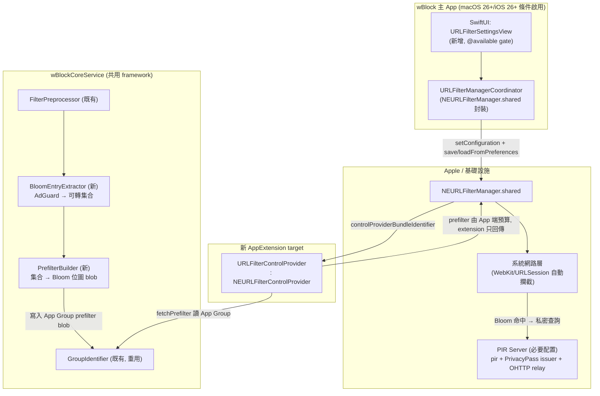

# wBlock × Apple URL Filters API 整合架構方案

> 目標形狀：向 upstream `0xCUB3/wBlock` 開 PR 的增量能力。
> 權威來源分級：**SDK 實測（macOS 26 SDK）> 已驗證網路研究 > repo 實測 > 推斷**。凡標 `[claim:asserted]` 者為推斷，implement 前須驗；`[claim:verified]` 為本規劃已親跑 grep/read 驗證。
> 日期：2026-07-16　模式：ceiling（Reasoning Sandwich + Decision-Log + reverse peer-review 已內化）

---

## 0. 前提校準（已驗證的 repo 事實）

| 事實 | 驗證方式 | 標籤 |
|---|---|---|
| deployment target macOS 12.3 / iOS 15.4 | `grep DEPLOYMENT_TARGET project.pbxproj` | `[claim:verified]` |
| 零 NetworkExtension / NEURLFilter 引用（綠地） | `grep -rl NetworkExtension --include=*.swift` → 空 | `[claim:verified]` |
| App Group base = `group.skula.wBlock`；macOS 走 team-prefix 解析（`GroupIdentifier.resolvedMacOSGroupIdentifier()`），iOS 用 base | read `GroupIdentifier.swift` | `[claim:verified]` |
| 共用 framework `wBlockCoreService`；含 `FilterPreprocessor`（actor）、`RemoveParamDNRRuleGenerator`（保守 AdGuard 子集轉換 enum precedent）、`ContentBlockerTargets` | ls + read | `[claim:verified]` |
| content blocker target 以 slot 對應 `rules_{category}_{platform}.json`，經 App Group 共享 | read `ContentBlockerTargets.swift` | `[claim:verified]` |
| `FilterListCategory` enum：ads/privacy/security/multipurpose/annoyances/experimental/custom/foreign/scripts | read | `[claim:verified]` |

**關鍵設計槓桿**：`RemoveParamDNRRuleGenerator` 是「AdGuard 規則 → 受限能力子集，保守跳過不可表達者」的**現成慣例**（其註解明言 "conservative... skipped rather than widened"）。URL Filter 的 Bloom 轉譯層應**鏡像此 enum 的形狀**（`public enum` + 靜態 `generate`、跳過而非放寬、產出寫 App Group），這是 upstream PR 最易被接受的形狀。`[claim:judgment]`

---

## 1. 方案總覽

### 1.1 架構圖

### 1.2 元件清單（新增/變更）

| 類型 | 名稱 | 位置 | 說明 |
|---|---|---|---|
| 新 target | `URLFilterControlProvider`（App Extension，NEURLFilterControlProvider protocol） | 新目錄 `wBlock URLFilter/` + `(iOS)` 對應 | `start()/stop(reason:)/fetchPrefilter(existingPrefilterTag:)`；只讀 App Group 的 prefilter blob 並封成 `NEURLFilterPrefilter` 回傳。**不做規則轉換**（轉換在 App 端 CoreService 完成，extension memory/time 受限）`[claim:judgment]` |
| 新 CoreService 模組 | `BloomEntryExtractor.swift` | `wBlockCoreService/` | AdGuard 規則 → 可轉 URL/domain 條目集合（見 §4）。純字串處理，可全平台編譯（不需 `@available`） |
| 新 CoreService 模組 | `PrefilterBuilder.swift` | `wBlockCoreService/` | 條目集合 → Bloom 位圖（bitCount/hashCount/murmurSeed + murmur3）；序列化為 App Group blob + tag（內容 hash） |
| 新 CoreService 模組 | `URLFilterManagerCoordinator.swift` | `wBlockCoreService/`（`@available(macOS 26.0, iOS 26.0, *)`） | 封裝 `NEURLFilterManager.shared`：setConfiguration / save+loadFromPreferences / status AsyncSequence / resetPIRCache |
| UI 變更 | `URLFilterSettingsView.swift` + 設定入口 | `wBlock/` SwiftUI | 條件顯示（執行期 `if #available`）：啟用開關、PIR 端點狀態、fail-open/closed 選擇、prefilter 覆蓋率顯示、隱私說明。**舊 OS 完全不渲染此區塊** |
| entitlement | `com.apple.developer.networking.networkextension.url-filter-provider` | 新 extension + App | dev-signed 豁免 OHTTP relay 申請；distribution 需 Apple 核准 |
| pbxproj | 2 新 target（mac/iOS）+ Embed App Extensions build phase | `wBlock.xcodeproj` | 高風險手術，見 Phase 3 |

---

## 2. 分階段實作計畫

> 每階段 Done-when 為**機械可驗證**條件。檔位建議依「off-rails 程度 + 不可逆性 + 架構決策密度」，非依行數。

### Phase 0 — 可行性 spike（隔離驗證，不進主 codebase）
- **內容**：獨立最小 Xcode 專案，單一 target 實作 `NEURLFilterControlProvider` + `NEURLFilterManager.setConfiguration` + 一個 stub PIR（或 Apple 範例 PIR server）。驗證：(a) entitlement 在 dev-signed 下可載入；(b) `verdict(for:)` 對 deny 條目回 `.deny`；(c) 無 PIR 可達時 `shouldFailClosed` 兩種語義的實際行為；(d) stub-PIR 是否可配置（決定模式 C 是否成立）。
- **Done-when**：`NEURLFilterManager.shared.status` AsyncSequence 產出 active 狀態（log 展示前5/後5行）；一個已知 deny URL 的 `verdict(for:)` 回 `.deny`、一個 allow URL 回 `.allow`/`.unknown`。
- **建議檔位**：**Opus**（無先例、SDK 語義+PIR+entitlement 三重 unknown，off-rails，架構決策密集）。
- **產出**：spike 報告（PIR 是否真的無法繞過、fail-open 是否可行、stub-PIR 可行性）回饋 Phase 1 決策矩陣。

### Phase 1 — CoreService 轉譯層（純資料，全平台編譯）
- **內容**：`BloomEntryExtractor` + `PrefilterBuilder`，鏡像 `RemoveParamDNRRuleGenerator` 慣例（`public enum`、保守跳過、單元測試覆蓋）。無 NE 依賴 → 可在 macOS 12.3 編譯與測試。
- **Done-when**：`swift test` 綠；給定固定 AdGuard 樣本（含 URL block / domain / cosmetic / exception 混合），extractor 產出的可轉條目數 == 預期黃金值；Bloom `contains()` 對 in-set URL 全命中、對 known-absent URL 誤判率 < 設定閾值（統計測試）。
- **建議檔位**：**Sonnet**（on-rails，有 `RemoveParamDNRRuleGenerator` 明確 precedent 可鏡像；murmur3/Bloom 是標準演算法）。

### Phase 2 — URLFilterManagerCoordinator + UI（條件啟用）
- **內容**：`@available` 封裝 manager；SwiftUI 設定頁；執行期 `if #available` gate。
- **Done-when**：舊 OS 建置（`#available` false 分支）UI 不含 URL Filter 區塊且既有 content blocker 測試全綠（**回歸不變式**）；macOS 26 上開關可觸發 `saveToPreferences()` 成功（狀態 log 展示）。
- **建議檔位**：**Sonnet**（SwiftUI + available gate 是 repo 既有慣例；coordinator 封裝 SDK 已由 Phase 0 澄清）。

### Phase 3 — Extension target + pbxproj 整合（高風險手術）
- **內容**：新增 2 個 App Extension target、entitlements、Embed build phase、App Group 共享設定；control provider 讀 App Group blob 回傳 prefilter。
- **Done-when**：`xcodebuild -scheme wBlock build` 對 mac+iOS 皆成功；extension bundle 出現在 `.app/Contents/PlugIns`（iOS `PlugIns`）；`codesign -d --entitlements` 顯示 url-filter-provider entitlement；既有 12 content blocker target 仍全數 build。
- **建議檔位**：**Opus**（pbxproj 手動編輯是最脆弱、不可逆性高、team-prefix App Group 路徑差異 edge case；破壞既有 target 風險最高）。⚠ **APPLY 前 gate**：pbxproj diff 摘要 + `git diff --stat` 確認只動預期 target。

### Phase 4 — 端到端 + PIR 決策落地 + 隱私文件
- **內容**：接上 Phase 3 決策矩陣選定的 PIR 模式；`PRIVACY_POLICY.md` 增補 URL Filter/PIR 隱私說明；README 增補條件能力說明。
- **Done-when**：真機/VM macOS 26 上，一條 wBlock ads 清單條目對應的追蹤 URL 被系統層攔截（實際瀏覽觀測，非 verdict 自報）；隱私文件 diff 含 PIR 保證段落。
- **建議檔位**：**Opus**（端到端整合 + 隱私立場論述 + upstream PR 敘事，判斷密集）。

---

## 3. PIR 基礎設施決策矩陣

> **硬事實**：`setConfiguration` 無 PIR-free 過載 → PIR server URL 是**必要參數**。純 prefilter-only 模式在 SDK 層**無法配置**（除非 Apple 允許指向一個「永遠回 unknown」的 stub PIR，見 open question 2）。`[claim:verified from SDK]`

| 模式 | 隱私 | 成本 | 誤判/覆蓋 | upstream 可行性 | 裁決 |
|---|---|---|---|---|---|
| **A. 自建 PIR server** | 最佳（wBlock 全掌控，需自證不記 log） | 高（伺服器營運 + OHTTP relay + PrivacyPass issuer + Apple 核准） | 完整 URL 精確查詢 | 低（開源專案難承諾長期營運基礎設施） | **不建議作為預設**；文件列為 self-host 選項 |
| **B. 託管/社群共享 PIR** | PIR 密碼學保證 server 看不到查詢內容（PIR 賣點）；metadata/可用性依賴第三方 | 中（分攤） | 完整 | 中（需信任營運方 + 資金） | **開放問題**，需 maintainer 裁決 |
| **C. Stub-PIR / prefilter-only 退化** | 最佳（無查詢離開裝置） | 最低 | **僅 Bloom 快篩**：命中即 deny（誤判擋錯站）、未命中放行；無 PIR 二次確認 → false positive 無補救 | 高（無基礎設施依賴） | **建議預設**，前提是 Phase 0 spike 證實 stub-PIR 可配置且不 fail-closed 全擋 |

**退化行為（Constraint b）**：
- `shouldFailClosed = false`（**建議預設**，隱私工具不應把使用者鎖在網外）：PIR 不可達 → 放行（fail-open）。風險：攔截失效但不破壞瀏覽。
- `shouldFailClosed = true`：PIR 不可達 → deny，可能大面積擋網 → **不設為預設**，僅進階選項並明確警告。
- **無 PIR server 部署時**：若模式 C 的 stub-PIR 不可行（Phase 0 待證），則 URL Filter 能力**整體不啟用**（開關 disabled + 說明），content blocker 照常運作 —— 不得因缺 PIR 而降級既有功能。

**開發階段（Constraint c）**：dev-signed build 豁免 OHTTP relay 申請 → Phase 0/1/2 全程用 dev signing + 本地/Apple 範例 PIR，不需 Apple 核准即可迭代。

---

## 4. 規則轉譯層 spec（BloomEntryExtractor + PrefilterBuilder）

### 4.1 輸入 / 輸出
- **輸入**：AdGuard 語法規則行（經 `FilterPreprocessor` 展開 include 後的字串），與既有 content blocker pipeline 同源。
- **輸出**：`[BloomEntry]`（正規化的 host / host+path token 集合）→ `PrefilterBlob { tag, bitCount, hashCount, murmurSeed, bitmap: Data }` 寫入 App Group（重用 `GroupIdentifier.shared.value`）。

### 4.2 可轉 / 不可轉分類（保守，鏡像 RemoveParamDNRRuleGenerator）

| AdGuard 規則類型 | 可轉? | 理由 |
|---|---|---|
| 純網路 block `\|\|example.com^` | ✅ | 映射為 host deny 條目 |
| domain-anchored `\|\|ads.example.com^` | ✅ | host 條目 |
| 純 URL 子串 `/ads/banner.js` | ⚠ 部分 | Bloom 是集合成員測試，只能存**離散完整 URL/host**，無法做子串/pattern 匹配 → 僅當可展開為有限 host+path 才轉；含 `*`/regex → **跳過** |
| exception `@@\|\|example.com^` | ❌ | Bloom 無法表達 allowlist（成員測試無「排除」語義）；exception 須在 App 端於建位圖**前**從集合做差集移除 |
| cosmetic `example.com##.ad` | ❌ | 非網路層，URL Filter 無此能力 |
| scriptlet `#%#//scriptlet(...)` | ❌ | 同上 |
| `$removeparam` / `$csp` / modifier 類 | ❌ | 非 deny 決策，跳過 |

**規則**：不確定即跳過（不放寬），與 `RemoveParamDNRRuleGenerator` 的「conservative, skip rather than widen」一致。

### 4.3 覆蓋率估算方法
1. 對每張既有清單跑 extractor，記 `convertible / total` 比。
2. 分類統計跳過原因（cosmetic / exception / pattern / modifier）→ 輸出報表。
3. Bloom 誤判率：以目標 `p`（如 0.1%）反解 `bitCount = -(n·ln p)/(ln2)²`、`hashCount = (bitCount/n)·ln2`；單元測試以隨機 known-absent URL 樣本實測誤判率，斷言 ≤ 目標。
4. `tag` = 條目集合內容 hash → `fetchPrefilter(existingPrefilterTag:)` 可據此判斷是否需重建（未變則回 nil/沿用）。

### 4.4 murmur / 位圖
- `NEURLFilterPrefilter` 欄位 `murmurSeed: UInt32` → 用 murmur3 x86_32；`PrefilterData` 小資料走 `.smallFilter(Data)`、大位圖走 `.temporaryFilepath(URL)`（避免 XPC 傳大 Data）。`[claim:asserted：.temporaryFilepath 適用門檻需 Phase 0 實測]`

---

## 5. Edge Cases 處理

| Edge case | 處理 |
|---|---|
| iOS 系統 content filter 數量上限 | URL Filter 走獨立 NE provider slot，**不佔** content blocker 的 slot 配額；但 iOS 對 NE 也有限制 → Phase 0 驗證單一 provider 可載入即足（wBlock 只需 1 個 URL filter provider） |
| Bloom false positive 擋錯站 | UX：設定頁顯示「URL Filter 為機率性快篩」；提供 per-site allowlist（差集移除該 host 後重建位圖）；模式 C 下這是唯一補救（無 PIR 二次確認） |
| PIR token 過期 / server 不可達 | `URLFilterManagerCoordinator` 監聽 status AsyncSequence；不可達 → 依 `shouldFailClosed` 設定行為（預設 fail-open）+ UI 狀態指示；提供 `refreshPIRParameters()`/`resetPIRCache()` 手動按鈕 |
| App Group team-prefix 路徑差異 | **重用既有 `GroupIdentifier.resolvedMacOSGroupIdentifier()`**（已處理 team-prefix vs base + signing entitlements 來源）→ extension 與 App 用同一解析邏輯讀寫 prefilter blob，不重造 |
| prefilter 建置在 extension vs App | 轉換在 **App 端 CoreService** 完成寫 App Group；extension `fetchPrefilter` 只讀+封裝回傳（extension 記憶體/時間受限，不做百萬級轉換） |

---

## 6. 風險清單與開放問題（★ = 需 upstream maintainer 裁決）

1. ★ **PIR 基礎設施承諾**：wBlock 作為開源專案是否願營運/資助 PIR server（模式 B），或只出貨 prefilter-only（模式 C）？——**阻擋預設模式決策**，Phase 0 後必須先裁決。
2. ★ **stub-PIR 可行性**：SDK 是否允許「無真實 PIR，僅 Bloom」的配置（指向永遠回 unknown 的端點且不 fail-closed）？Phase 0 spike 的**首要驗證項**；若否，模式 C 不成立。
3. ★ **是否值得引入 PIR 隱私敘事複雜度**：wBlock 現有隱私賣點是「零查詢離開裝置」；即便 PIR 密碼學保證 server 看不到查詢，仍是新增網路面 → maintainer 需決定是否符合專案隱私哲學。
4. `.temporaryFilepath` 大位圖傳遞在 XPC 邊界的實際限制（Phase 0 實測）。
5. Apple OHTTP relay distribution 核准的前置條件與時程（影響 distribution build 上架，dev 迭代不受阻）。
6. iOS 上 URL Filter provider 與既有 content blocker + WebExtension 共存的資源/生命週期干擾（Phase 3 端到端驗）。
7. exception 規則差集移除的正確性：跨清單 allowlist 順序語義是否與 Safari content blocker 一致（避免兩條路徑行為分歧）。

---

## 7. Reverse peer-review（ceiling 自審一輪）

- **反駁「轉換放 App 端」**：若 App 未執行（背景），prefilter 過期？→ `fetchPrefilter` 由系統在 NE 生命週期觸發；若 App 端無法建，退化為沿用舊 tag。可接受，已記 open question 4/prefilterFetchInterval。
- **反駁「模式 C 為預設」**：prefilter-only 誤判無補救可能傷使用者信任 → 已加 per-site allowlist UX + 明確標示機率性；且以「不破壞既有 content blocker」為底線，URL Filter 純加值。成立。
- **反駁「鏡像 RemoveParamDNRRuleGenerator」**：Bloom 是集合而非規則清單，形狀不同 → 鏡像的是**慣例**（保守跳過、public enum、App Group 輸出、單元測試），非資料結構，論述成立。
